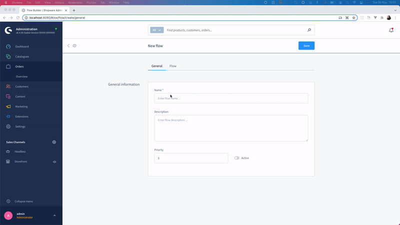

# SwagExamplePlugin
An integration for [Shopware 6](https://github.com/shopware/platform)
Plugin example for flow builder



**1. Clone git Repositories**

```bash
cd development/custom/plugins

git clone <THIS REPOSITORY>
```

**2. Install and activate plugin**

Run this command from development root
```bash
bin/console plugin:install --activate --clearCache SwagExamplePlugin
```

**3. Uninstall plugin**

Run this command from development root
```bash
bin/console plugin:uninstall --clearCache SwagExamplePlugin
```
